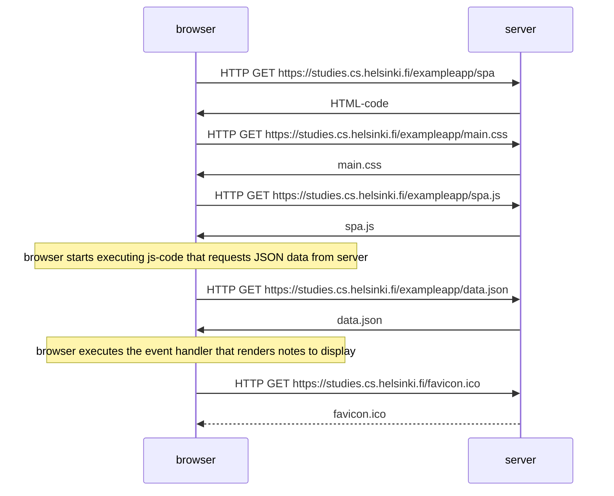

```mermaid
sequenceDiagram
browser->>server: HTTP GET https://studies.cs.helsinki.fi/exampleapp/spa
server->>browser: HTML-code
browser->>server: HTTP GET https://studies.cs.helsinki.fi/exampleapp/main.css
server->>browser: main.css
browser->>server: HTTP GET https://studies.cs.helsinki.fi/exampleapp/spa.js
server->>browser: spa.js
note over browser: browser starts executing js-code that requests JSON data from server
browser->>server: HTTP GET https://studies.cs.helsinki.fi/exampleapp/data.json
server->>browser: data.json
note over browser: browser executes the event handler that renders notes to display
browser->>server: HTTP GET https://studies.cs.helsinki.fi/favicon.ico
server-->>browser: favicon.ico
```